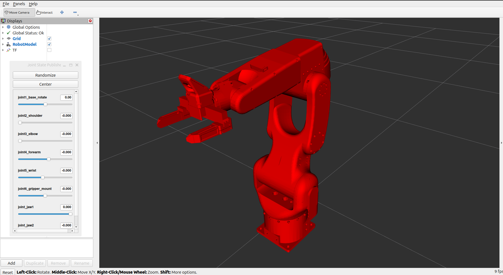

# vision-arm-ros2

A vision-guided pick-and-place system for a 6-DOF robotic arm, built on ROS 2 Jazzy. The system simulates the full manipulation stack in Gazebo Harmonic, plans motion with MoveIt 2, and is architected so the planning and task layers transfer to the physical stepper-driven arm and parallel gripper without modification.



## Overview

The platform is a 3D-printed 6-DOF arm driven by stepper motors, fitted with a parallel two-jaw gripper and an RGB-D camera. The arm had no native ROS support, so this project builds the complete stack from the ground up:

- A calibrated URDF model with joint limits derived from the motor firmware
- A physics simulation with the arm, gripper, camera, and a tabletop scene
- Motion planning and collision checking through MoveIt 2
- A perception pipeline that detects objects and localizes them in 3D (in progress)
- Task-level action servers that sequence approach, grasp, lift, and place (planned)

The end-to-end goal: point a camera at a table, say "pick the red cube", and have the arm do it, first in simulation, then on real hardware.

## System Architecture

The system follows a layered architecture with one ROS 2 package per concern. Layers communicate only through standard ROS 2 interfaces (topics, TF, actions, `ros2_control`), so each layer can be developed, tested, and replaced in isolation.

```
+----------------------------------------------------------------------+
|  vision_arm_tasks (planned)                                          |
|  Pick / Place / GoToNamed action servers, sequenced via MoveIt       |
+----------------------------------------------------------------------+
|  vision_arm_moveit_config                                            |
|  MoveIt 2: KDL inverse kinematics, OMPL planning, collision checking |
+----------------------------------------------------------------------+
|  vision_arm_perception (planned)                                     |
|  RGB-D -> detection -> tracking -> 3D pose -> TF frames              |
+----------------------------------------------------------------------+
|  vision_arm_gazebo                                                   |
|  Gazebo Harmonic world, ros2_control controllers, sensor bridge     |
+----------------------------------------------------------------------+
|  vision_arm_description                                              |
|  URDF/xacro model: arm, gripper, camera, inertials, joint limits    |
+----------------------------------------------------------------------+
```

Data flow at runtime: the simulated (or real) RGB-D camera publishes images, the perception layer converts detections into `vision_msgs/Detection3DArray` messages and per-object TF frames, the task layer turns an object frame into a grasp goal, MoveIt plans a collision-free trajectory, and `ros2_control` executes it through a `joint_trajectory_controller`.

### Design principles

- **Separation of concerns.** Each package owns exactly one responsibility. The perception layer knows nothing about motion planning; the task layer never touches joint commands directly.
- **Interface-driven boundaries.** The perception contract is `vision_msgs/Detection3DArray` plus one TF frame per tracked object. Any detector honoring this contract (HSV threshold, YOLO, or a future model) is a drop-in replacement selected by a launch parameter.
- **Simulation and hardware parity.** Controllers are defined through `ros2_control`, so the Gazebo plugin and the future hardware interface expose identical command and state interfaces. Code built against simulation carries over to the real arm untouched.
- **Configuration over code.** Controller gains, joint limits, kinematics solvers, and named poses live in YAML, not source.
- **Incremental verification.** Every phase has an explicit acceptance check (model articulates in RViz, controllers track in Gazebo, planner avoids the table) and no phase begins until the previous one passes.

## Repository Layout

```
vision-arm-ros2/
  src/
    vision_arm_description/    URDF/xacro, meshes, RViz config, display launch
    vision_arm_gazebo/         world SDF, spawn launch, controller and bridge YAML
    vision_arm_moveit_config/  SRDF, kinematics, joint limits, MoveIt launches
  docs/
    images/                    README media
  LICENSE
```

## Packages

### vision_arm_description

The single source of truth for the robot model. A modular xacro builds the arm, mounts the gripper on the flange, and attaches the camera frame.

- Six revolute joints with position limits derived from the stepper firmware step counts multiplied by each joint's gear ratio, then cross-checked against the arm's computed work envelope. The model can only reach what the physical arm can reach.
- Full inertial parameters per link, required for stable physics simulation.
- `ros2_control` position interfaces on every joint, shared by simulation and future hardware.
- Prismatic two-jaw gripper with a tool center point (`tcp`) frame at the grasp midpoint.
- `display.launch.py` brings the model up in RViz with a joint slider GUI.

### vision_arm_gazebo

Everything needed to run the robot in Gazebo Harmonic.

- A tabletop world with three colored 3 cm cubes sized to the gripper stroke.
- Robot spawning through `gz_ros2_control`, so the simulated arm is driven by the same controller stack as real hardware.
- Controllers: `joint_state_broadcaster`, a `joint_trajectory_controller` for the arm, and a position controller for the gripper. Spawners are chained sequentially to avoid racing the controller manager during startup.
- A `ros_gz` bridge exposing RGB, depth, point cloud, and camera info topics to ROS.

### vision_arm_moveit_config

MoveIt 2 configuration connecting planning to execution.

- Planning groups `arm` and `gripper` with named states (`home`, `open`, `closed`).
- KDL inverse kinematics; the arm's spherical wrist is well-conditioned for numeric solvers.
- Self-collision matrix computed in the SRDF, keeping the URDF a faithful description of the hardware rather than encoding safety margins into joint limits.
- `demo.launch.py` for planning in RViz against the Gazebo simulation.

## Technology Stack

| Component | Choice | Rationale |
|---|---|---|
| Middleware | ROS 2 Jazzy (LTS) | Long-term support release matching Ubuntu 24.04 |
| Simulation | Gazebo Harmonic | Native `gz_ros2_control` and RGB-D sensor support |
| Motion planning | MoveIt 2 with KDL | Numeric IK suits the spherical wrist; OMPL for planning |
| Control | `ros2_control` | Single controller definition for simulation and hardware |
| Detection (planned) | YOLO11n exported to ONNX | Best accuracy per FLOP in the nano class; runs CPU-only through `onnxruntime` |
| Detection post-processing (planned) | Roboflow `supervision` | NMS, ByteTrack ID-stable tracking, and zone filtering |
| Perception contract | `vision_msgs` + TF2 | Standard message types keep detectors interchangeable |

## Getting Started

### Prerequisites

Ubuntu 24.04 with ROS 2 Jazzy:

```bash
sudo apt install ros-jazzy-desktop ros-jazzy-moveit \
  ros-jazzy-ros-gz ros-jazzy-gz-ros2-control \
  ros-jazzy-ros2-controllers ros-jazzy-vision-msgs \
  python3-colcon-common-extensions
```

### Build

```bash
git clone <this-repo> vision-robotic-arm
cd vision-robotic-arm
colcon build --symlink-install
source install/setup.bash
```

### Run

Visualize and articulate the model in RViz:

```bash
ros2 launch vision_arm_description display.launch.py
```

Launch the simulation with controllers and the sensor bridge:

```bash
ros2 launch vision_arm_gazebo spawn.launch.py
```

Add `headless:=true` to run the simulation server without the GUI (used for scripted runs and CI).

Plan and execute motions with MoveIt from RViz:

```bash
ros2 launch vision_arm_moveit_config demo.launch.py
```

## Engineering Notes

- **Joint limits from firmware, not guesswork.** The original model declared every joint as continuous with no limits. This project derives per-joint position limits from the firmware's step-count bounds multiplied by each gear ratio, cross-checked against the arm's computed work envelope.
- **Collision geometry is simplified.** Visual meshes are high-resolution STL; collision checking uses simplified geometry so planning-scene queries stay fast.
- **Self-collision handling lives in MoveIt.** The SRDF collision matrix owns self-collision avoidance, keeping the model layer a faithful description of the hardware.
- **Controller startup is sequenced.** Controller spawners activate one at a time, chained on process exit events, because concurrent activation raced the controller manager's switch lock during simulation startup.

## Next Steps

Work is sequenced so every step produces something demonstrable:

1. **Perception package (`vision_arm_perception`).** One node subscribing to RGB, aligned depth, and camera info. Bring-up detector using HSV segmentation, then YOLO11n over ONNX Runtime behind the same interface. Post-processing with `supervision`: non-maximum suppression, ByteTrack for identity-stable tracking, and a polygon zone restricting detections to the table. Detected boxes are deprojected through camera intrinsics and published as `Detection3DArray` plus one TF frame per object.
2. **Task package (`vision_arm_tasks`).** `Pick`, `Place`, and `GoToNamed` action servers built on the MoveIt `MoveGroupInterface`, completing the camera-to-grasp demo: send a pick goal for a detected object, watch the arm grasp it in simulation.
3. **Bringup package.** A single top-level launch composing simulation, perception, planning, and tasks.
4. **Continuous integration.** A GitHub Actions workflow building all packages and running `colcon test` on every push.
5. **Detector fine-tuning.** Capture simulation frames, auto-label them with the HSV detector, fine-tune YOLO11n, and export to ONNX.
6. **Real hardware.** A `ros2_control` hardware interface for the arm's serial stepper controller and the gripper's CAN bus, an RGB-D camera driver, and hand-eye calibration. The planning and task layers above run unchanged.

## License

Apache License 2.0. See [LICENSE](LICENSE).
